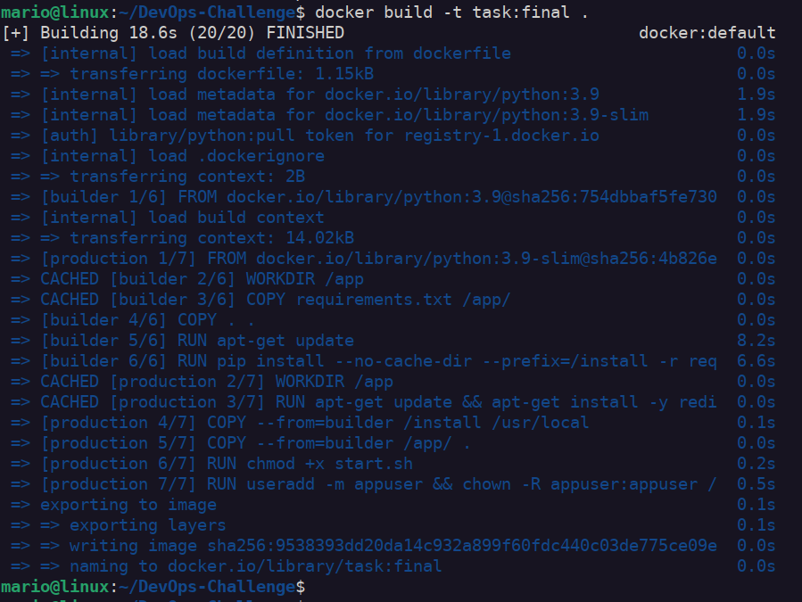
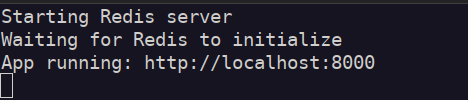
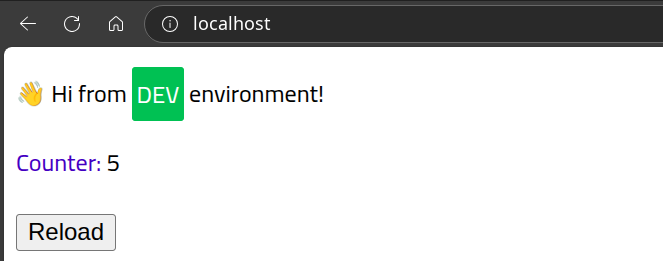

```markdown
# Python Web Application with Redis

A containerized Python web application that uses Redis for data storage, all running within a single Docker container.

## 🏗️ Architecture

This project demonstrates a single-container approach where both Redis server and the Python application run together, managed by a startup script.

## 📋 Prerequisites

- Docker installed on your system
- Basic knowledge of Python and Redis

## 🚀 Quick Start

### 1. Build the Docker Image

```bash
docker build -t devops:test .
```

### 2. Run the Container

```bash
docker run -p 8000:8000 devops:test
```

The application will be available at `http://localhost:8000`

## 📁 Project Structure

```
.
├── Dockerfile          # Multi-stage Docker build
├── start.sh            # Startup script for Redis and Python app
├── hello.py            # Main Python application
├── requirements.txt    # Python dependencies
└── README.md          # This file
```

## 🐳 Docker Configuration

### Multi-Stage Build

The Dockerfile uses a two-stage build process:

- **Builder Stage**: Installs Python dependencies
- **Production Stage**: Creates the final lightweight image with Redis

### Complete Dockerfile

```dockerfile
# ------------ Building Stage ----------------

FROM python:3.9 AS builder

#determining the working dir
WORKDIR /app

#Copying the dependencise, files that should be installed
COPY requirements.txt /app/
COPY . .

RUN apt-get update 

#Installing the requirements & cleaning cache
RUN pip install --no-cache-dir --prefix=/install -r requirements.txt 

# ------------ Production Stage ----------------

FROM python:3.9-slim AS production
WORKDIR /app

RUN apt-get update && apt-get install -y redis-server curl && \
   apt-get clean && rm -rf /var/lib/apt/lists/*


#copy the shell script, dependencies, and code from builder
COPY --from=builder /install /usr/local
COPY --from=builder /app/ .

RUN chmod +x start.sh

#Expose app port
EXPOSE 8000

# Set environmet variables
ENV ENVIRONMENT=DEV \
    HOST=localhost \ 
    PORT=8000 \ 
    REDIS_HOST=localhost \
    REDIS_PORT=6379 \
    REDIS_DB=0

#making a non-root user and switch to it
RUN useradd -m appuser && chown -R appuser:appuser /app
USER appuser
ENTRYPOINT [ "./start.sh" ]
CMD ["python3", "hello.py"]
```

### Dockerfile Explanation

#### **Building Stage (Lines 1-15)**

**Line 3: Base Image Selection**
```dockerfile
FROM python:3.9 AS builder
```
- Uses the official Python 3.9 image as the foundation
- Names this stage "builder" for reference in the production stage
- This stage will handle dependency installation

**Line 6: Working Directory**
```dockerfile
WORKDIR /app
```
- Sets `/app` as the working directory inside the container
- All subsequent commands will run from this directory

**Lines 9-10: File Copying Strategy**
```dockerfile
COPY requirements.txt /app/
COPY . .
```
- Copies `requirements.txt` first (Docker layer caching optimization)
- Then copies all project files to the working directory
- This order ensures dependencies are cached separately from code changes

**Lines 12-15: Package Installation**
```dockerfile
RUN apt-get update 
RUN pip install --no-cache-dir --prefix=/install -r requirements.txt
```
- Updates the package lists
- Installs Python dependencies with special flags:
  - `--no-cache-dir`: Prevents pip from storing cache (reduces image size)
  - `--prefix=/install`: Installs packages to `/install` for easy copying later

#### **Production Stage (Lines 17-39)**

**Lines 19-20: Slim Base Image**
```dockerfile
FROM python:3.9-slim AS production
WORKDIR /app
```
- Uses `python:3.9-slim` - a much smaller base image (~100MB vs ~900MB)
- Sets working directory for the production environment

**Lines 22-23: System Dependencies**
```dockerfile
RUN apt-get update && apt-get install -y redis-server curl && \
   apt-get clean && rm -rf /var/lib/apt/lists/*
```
- Installs Redis server and curl in a single layer
- Cleans up package cache immediately to keep image size small
- Uses `&&` to chain commands in one RUN instruction (fewer layers)

**Lines 26-27: Copying from Builder**
```dockerfile
COPY --from=builder /install /usr/local
COPY --from=builder /app/ .
```
- Copies only the installed Python packages from the builder stage
- Copies the application code
- This avoids carrying over build tools and temporary files

**Line 29: Script Permissions**
```dockerfile
RUN chmod +x start.sh
```
- Makes the startup script executable
- Necessary because file permissions aren't preserved in COPY operations

**Line 32: Port Documentation**
```dockerfile
EXPOSE 8000
```
- Documents that the application listens on port 8000
- This is metadata only - actual port mapping happens at runtime

**Lines 35-40: Environment Configuration**
```dockerfile
ENV ENVIRONMENT=DEV \
    HOST=localhost \ 
    PORT=8000 \ 
    REDIS_HOST=localhost \
    REDIS_PORT=6379 \
    REDIS_DB=0
```
- Sets default environment variables for the application
- Can be overridden at runtime using `-e` flag
- Provides sensible defaults for local development

**Lines 43-44: Security Setup**
```dockerfile
RUN useradd -m appuser && chown -R appuser:appuser /app
USER appuser
```
- Creates a non-root user named `appuser` with a home directory (`-m` flag)
- Changes ownership of the `/app` directory to the new user
- Switches to run as the non-root user (security best practice)

**Lines 45-46: Container Startup**
```dockerfile
ENTRYPOINT [ "./start.sh" ]
CMD ["python3", "hello.py"]
```
- `ENTRYPOINT`: Always runs the startup script
- `CMD`: Provides default arguments to the entrypoint
- Result: `./start.sh python3 hello.py` (script receives the Python command as `$@`)

### Startup Script (start.sh)

```bash
#!/bin/sh

clear

#booting up the redis server
echo "Starting Redis server"
redis-server --daemonize yes

#wait for redis server to boot
echo "Waiting for Redis to initialize"
sleep 4 

exec "$@"
```

### Script Explanation

**Line 1: Shebang**
```bash
#!/bin/sh
```
- Specifies that the script should be executed using the Bourne shell (`/bin/sh`)
- Uses `sh` instead of `bash` for better compatibility with slim images

**Line 3: Screen Clear**
```bash
clear
```
- Clears the terminal screen for a clean startup output
- Improves readability of startup messages

**Lines 5-7: Redis Server Startup**
```bash
echo "Starting Redis server"
redis-server --daemonize yes
```
- Displays a user-friendly message about Redis startup
- Starts Redis server with `--daemonize yes` flag:
  - `--daemonize yes`: Runs Redis in the background as a daemon process
  - This prevents Redis from blocking the script execution

**Lines 9-11: Initialization Wait**
```bash
echo "Waiting for Redis to initialize"
sleep 4
```
- Informs the user that the script is waiting for Redis
- `sleep 4`: Waits 4 seconds to ensure Redis is fully initialized
- This simple approach gives Redis time to start accepting connections

**Line 13: Command Execution**
```bash
exec "$@"
```
- `exec`: Replaces the current shell process with the specified command
- `"$@"`: Expands to all arguments passed to the script
- In this case, it receives `python3 hello.py` from the Dockerfile's CMD
- Using `exec` ensures the Python process becomes PID 1 (important for signal handling)

### How It All Works Together

1. **Container starts** → Docker runs `./start.sh python3 hello.py`
2. **Script begins** → Clears screen and shows startup messages
3. **Redis starts** → Launches in background daemon mode
4. **Wait period** → 4-second pause for Redis initialization
5. **Python app** → `exec` replaces the shell with the Python application
6. **Both services** → Redis runs in background, Python app in foreground

This approach ensures that both Redis and the Python application are running within the same container, with Redis ready to accept connections when the Python application starts.

### Environment Variables

| Variable | Default Value | Description |
|----------|---------------|-------------|
| `ENVIRONMENT` | `DEV` | Application environment |
| `HOST` | `localhost` | Application host |
| `PORT` | `8000` | Application port |
| `REDIS_HOST` | `localhost` | Redis server host |
| `REDIS_PORT` | `6379` | Redis server port |
| `REDIS_DB` | `0` | Redis database number |

### Security Features

- Runs as non-root user (`appuser`)
- Multi-stage build for smaller image size
- Proper file permissions

## 🔧 How It Works

1. **Container Startup**: The `start.sh` script is executed as the entrypoint
2. **Redis Initialization**: Redis server starts in daemon mode
3. **Application Launch**: Python application starts and connects to Redis
4. **Service Ready**: Both services are running and ready to handle requests

## 📝 Usage Examples

### Basic Usage

```bash
# Build and run
docker build -t task:final .
docker run -p 80:8000 task:final
```


### Run a Container

```bash
docker run -it -p 80:8000 --name my-app task:final
```


### Testing the container



## 🧪 Testing

To verify everything is working:

1. Check if the container is running:
   ```bash
   docker ps
   ```

2. Test the application endpoint:
   ```bash
   curl http://localhost:80
   ```

3. Check container logs for any issues:
   ```bash
   docker logs task:final
   ```

## 📚 Additional Notes

- Redis data is ephemeral and will be lost when the container stops
- For production use, consider using external Redis or persistent volumes
- The startup script waits 4 seconds for Redis to initialize
- All services run as the `appuser` for security

## 🤝 Contributing

1. Fork the repository
2. Create a feature branch
3. Make your changes
4. Test the Docker build
5. Submit a pull request


You can find the Docker Hub Image here: [Docker Hub Image](https://hub.docker.com/repository/docker/mariosamir123/pyredis/general).